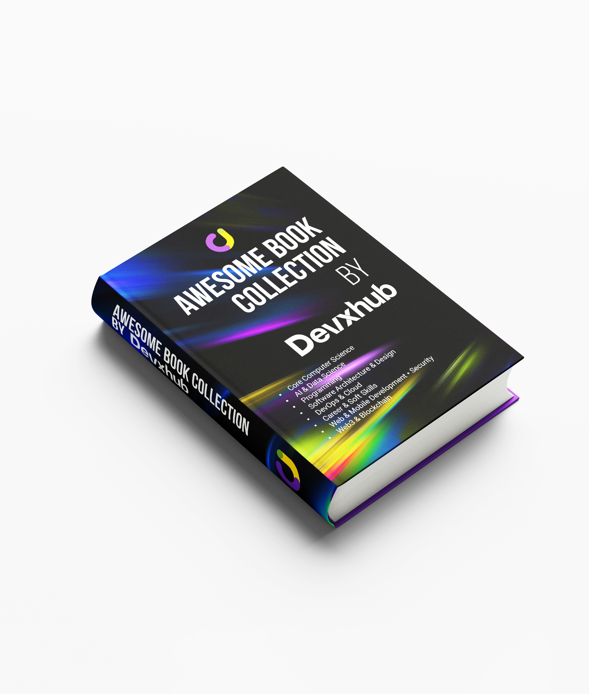

<!--
  Modern & Advanced Professional README for Books-Collection
-->

  
  <h1>📚 Awesome Book Collection</h1>
  

    <strong style="font-size:1.2em;">A meticulously curated collection of technical books covering programming, software engineering, system design, and more.</strong>
  

  

    <a href="#categories">Categories</a> •
    <a href="#featured-books">Featured Books</a> •
    <a href="#how-to-use">How to Use</a> •
    <a href="#contributing">Contributing</a>
  

   
  
  
  
    
  

---

## 📚 Complete Book Collection

### 📊 Collection Statistics
- **Total Books**: 165+ PDF files
- **Categories**: 20+ organized categories
- **Featured Collection**: Complete "10 Books for Software Engineers" set
- **Last Updated**: February 2026.

### 🏆 Essential Software Engineering Books (Complete Set)
✅ **All 10 Essential Books Included:**
1. **The Pragmatic Programmer** - Andrew Hunt, David Thomas  
   📖 [20th Anniversary Edition](Problem%20Solving/David%20Thomas,%20Andrew%20Hunt%20-%20The%20Pragmatic%20Programmer_%20Your%20Journey%20To%20Mastery,%2020th%20Anniversary%20Edition%20(2019,%20Addison-Wesley%20Professional)%20-%20libgen.li.pdf) | [Original Edition](Problem%20Solving/Andrew%20Hunt,%20David%20Thomas%20-%20The%20Pragmatic%20Programmer_%20From%20Journeyman%20to%20Master%20(1999,%20Addison-Wesley%20Professional)%20-%20libgen.lc%20(1).pdf)
2. **Designing Data-Intensive Applications** - Martin Kleppmann  
   📖 [Read Book](Software%20Architecture/_Designing%20Data%20Intensive%20Applications.pdf)
3. **The Mythical Man-Month** - Frederick P. Brooks Jr.  
   📖 [Read Book](Software%20Engineering/mythical-man-month.pdf)
4. **Refactoring** - Martin Fowler  
   📖 [Read Book](Software%20Engineering/Martin%20Fowler%20-%20Refactoring%20-%20Improving%20the%20Design%20of%20Existing%20Code.pdf)
5. **Software Architecture: The Hard Parts** - Neal Ford, Mark Richards, Pramod Sadalage, Zhamak Dehghani  
   📖 [Read Book](Software%20Architecture/Software%20Architecture%20The%20Hard%20Parts%20-%20Neal%20Ford,%20Mark%20Richards,%20Pramod%20Sadalage,%20Zhamak%20Dehghani.pdf)
6. **Working Effectively with Legacy Code** - Michael C. Feathers  
   📖 [Read Book](programming/refactoring/[Robert%20C.%20Martin%20series]%20Feathers,%20Michael%20C%20-%20Working%20effectively%20with%20legacy%20code%20(2013,%20Prentice%20Hall%20PTR)%20-%20libgen.li.pdf)
7. **Database Internals** - Alex Petrov  
   📖 [Read Book](Databases/Alex%20Petrov%20-%20Database%20Internals_%20A%20Deep%20Dive%20into%20How%20Distributed%20Data%20Systems%20Work-O'Reilly%20Media%20(2019).pdf)
8. **A Philosophy of Software Design** - John Ousterhout  
   📖 [Read Book](Software%20Architecture/A%20Philosophy%20of%20Software%20Design%20-%20John%20Ousterhout.pdf)
9. **Clean Code** - Robert C. Martin  
   📖 [Read Book](programming/clean-code/Clean%20Code_%20A%20Handbook%20of%20Agile%20Software%20Craftsmanship%20-%20Robert%20C.%20Martin.pdf)
10. **Why Programs Fail** - Andreas Zeller  
    📖 [Read Book](Software%20Engineering/Why_Programs_Fail_Second_Edition_A_Guide_to_Systematic_Debugging__2009by-Andreas_Zeller.pdf)

[→ View complete catalog of 165+ books](BOOKS_LIST.md)

---

## 🌟 Featured Book of the Week

**Designing Data-Intensive Applications** by Martin Kleppmann  
📖 [Read Now](Software%20Architecture/_Designing%20Data%20Intensive%20Applications.pdf)

*Why you should read it: This book is a comprehensive guide to the principles and practices of building scalable, reliable data systems. Essential for anyone working with modern data infrastructure.*

## 📚 Collection by Category

### Core Computer Science
- **Algorithms** — Data structures, optimization, competitive programming
- **Databases** — SQL, NoSQL, design, performance
- **Operating Systems** — Concepts, design, Linux
- **Networking** — Protocols, distributed systems, TCP/IP
- **Security** — Cryptography, ethical hacking, secure coding
- **Compilers** — Language design, parsing, code generation

### Software Development
- **Programming Languages** — Python, Java, JavaScript, Go
- **Design Patterns** — OOP, architectural patterns, best practices
- **Clean Code** — Maintainability, readability, refactoring
- **Concurrency** — Parallel programming, threading, async
- **Testing** — Unit testing, integration testing, test automation
- **Debugging** — Troubleshooting, profiling, analysis

### Architecture & Design
- **System Design** — Scalability, distributed architecture, microservices
- **Software Architecture** — Patterns, principles, trade-offs
- **Microservices** — Design, deployment, communication
- **Domain-Driven Design** — Domain modeling, event sourcing
- **API Design** — REST, GraphQL, versioning
- **Monolith to Microservices** — Migration strategies

### DevOps & Cloud
- **Docker & Kubernetes** — Containerization, orchestration
- **CI/CD** — Automation, pipelines, deployment
- **Infrastructure as Code** — Terraform, Ansible, CloudFormation
- **Cloud Computing** — AWS, Azure, GCP
- **Monitoring & Observability** — Logging, metrics, tracing
- **DevSecOps** — Security in CI/CD

### Data & AI
- **Machine Learning** — Algorithms, supervised learning, unsupervised learning
- **Deep Learning** — Neural networks, transformers, CNNs
- **Data Science** — Analysis, visualization, statistical methods
- **Big Data** — Distributed processing, Spark, Hadoop
- **Natural Language Processing** — Text processing, NLP models
- **Computer Vision** — Image analysis, object detection

### Modern Tech
- **Web Development** — Frontend, backend, full-stack
- **Mobile Development** — iOS, Android, cross-platform
- **Blockchain & Web3** — Smart contracts, DeFi, cryptography
- **Game Development** — Game design, engines, graphics

### Professional Growth
- **Soft Skills** — Communication, leadership, teamwork
- **Career Development** — Technical interviews, career growth
- **Problem Solving** — System design interviews, algorithms
- **Technical Leadership** — Team building, mentoring
- **Productivity** — Time management, effectiveness

---

## 📈 Collection Overview

### 🎯 What Makes This Collection Special
- **Complete Essential Set**: All 10 must-have books for software engineers
- **Comprehensive Coverage**: From algorithms to system design, DevOps to AI
- **Well Organized**: Logical categorization for easy navigation
- **Quality Focus**: Curated selection of industry-standard books
- **Regular Updates**: Continuously maintained and expanded

### 📚 Category Breakdown
| Category | Count | Key Topics |
|----------|-------|------------|
| **Programming** | 35+ | Clean Code, Design Patterns, Concurrency, Testing |
| **Software Architecture** | 25+ | System Design, Microservices, DDD, Patterns |
| **Databases** | 20+ | MySQL, PostgreSQL, Redis, Elasticsearch, MongoDB |
| **DevOps** | 15+ | Docker, Kubernetes, CI/CD, Infrastructure |
| **Algorithms** | 10+ | Data Structures, Competitive Programming |
| **Networking** | 10+ | Computer Networks, Protocols, Security |
| **Operating Systems** | 10+ | OS Concepts, Linux, System Programming |
| **Security** | 8+ | Web Security, Cryptography, Ethical Hacking |
| **Machine Learning** | 5+ | ML Algorithms, Deep Learning, AI |
| **Soft Skills** | 7+ | Leadership, Communication, Career Growth |

---

## 🚀 How to Use

1. **Browse by Category**: Navigate through the folder structure to find books by topic
2. **Search**: Use GitHub's search functionality to find specific books or topics
3. **Download**: Click on any book to view or download it
4. **Contribute**: Add your own books by creating a pull request

---

## ⭐ Community Reviews

**The Pragmatic Programmer** ⭐⭐⭐⭐⭐
*"Changed how I approach coding completely!"* - Emily Johnson

**Clean Code** ⭐⭐⭐⭐⭐  
*"Every developer should read this twice!"* - Michael Anderson

[📝 Submit Your Review](https://github.com/devxhub/awesome-book-collection/issues/new?template=review.md)

## 📢 Share Now

**How To Share**

[📘 Share on Facebook](https://www.facebook.com/sharer/sharer.php?u=https://github.com/devxhub/awesome-book-collection)  
[💼 Share on LinkedIn](https://www.linkedin.com/sharing/share-offsite/?url=https://github.com/devxhub/awesome-book-collection)   
[✈️ Share on Telegram](https://t.me/share/url?url=https://github.com/devxhub/awesome-book-collection&text=Check%20out%20this%20awesome%20collection%20of%20165%2B%20technical%20books!)  
[🐦 Share on 𝕏 (Twitter)](https://twitter.com/intent/tweet?text=Check%20out%20this%20awesome%20collection%20of%20165%2B%20technical%20books!&url=https://github.com/devxhub/awesome-book-collection)

## 🤝 Contributing

Have a great technical book? Contributions are welcome!

1. Fork the repository
2. Add your book to the appropriate category
3. Update category READMEs if needed
4. Submit a pull request

Please ensure books are legally shareable and properly attributed.

---

## 📄 License

This project is licensed under the **MIT License** — see [LICENSE](LICENSE) file for details.

---

## ⚠️ Note

This repository is for educational purposes. We don't own the rights to these books. Please support authors by purchasing books you find valuable.

**Owner:** [Devxhub](https://devxhub.com/)

**Stay Connected**
[📘 Facebook](https://facebook.com/devxhubltd)
[💼 LinkedIn](https://linkedin.com/company/devxhubltd)
[🐦 Twitter/X](https://twitter.com/devxhub)
[🎥 YouTube](https://youtube.com/@devxhub)
[💻 GitHub](https://github.com/devxhub)
 
---
 
*© 2026 Devxhub Limited. All Rights Reserved.*